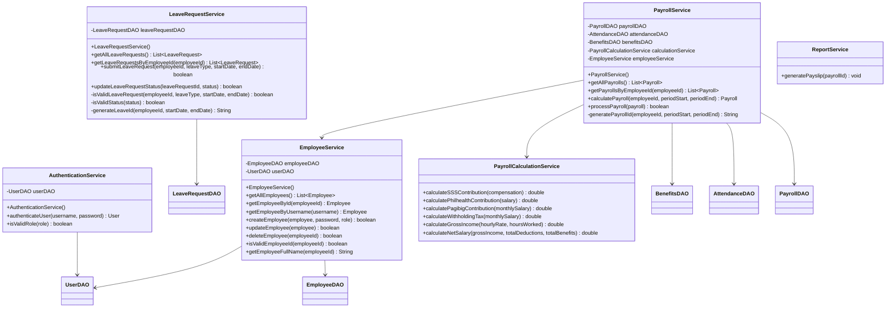

# MotorPH Payroll System - Class Diagram

## System Architecture Overview

The MotorPH Payroll System follows a layered architecture with clear separation of concerns:

```
┌─────────────────────────────────────────────────────────────────────────────────┐
│                                VIEW LAYER                                       │
├─────────────────────────────────────────────────────────────────────────────────┤
│  LoginForm          HRManagerDashboard    EmployeeDashboard    PayrollStaffDashboard │
└─────────────────────────────────────────────────────────────────────────────────┘
                                        │
                                        ▼
┌─────────────────────────────────────────────────────────────────────────────────┐
│                              CONTROLLER LAYER                                   │
├─────────────────────────────────────────────────────────────────────────────────┤
│                            LoginController                                      │
└─────────────────────────────────────────────────────────────────────────────────┘
                                        │
                                        ▼
┌─────────────────────────────────────────────────────────────────────────────────┐
│                               SERVICE LAYER                                     │
├─────────────────────────────────────────────────────────────────────────────────┤
│  AuthenticationService  EmployeeService  LeaveRequestService  PayrollService    │
│  PayrollCalculationService              ReportService                           │
└─────────────────────────────────────────────────────────────────────────────────┘
                                        │
                                        ▼
┌─────────────────────────────────────────────────────────────────────────────────┐
│                                 DAO LAYER                                       │
├─────────────────────────────────────────────────────────────────────────────────┤
│  DatabaseConnection  UserDAO  EmployeeDAO  LeaveRequestDAO  PayrollDAO         │
│  AttendanceDAO      BenefitsDAO                                                 │
└─────────────────────────────────────────────────────────────────────────────────┘
                                        │
                                        ▼
┌─────────────────────────────────────────────────────────────────────────────────┐
│                                MODEL LAYER                                      │
├─────────────────────────────────────────────────────────────────────────────────┤
│  User    Employee    LeaveRequest    Payroll    Attendance    Benefits          │
└─────────────────────────────────────────────────────────────────────────────────┘
```

## Detailed Class Diagrams

### Model Layer (Domain Objects)

```mermaid
classDiagram
    class User {
        -String id
        -String username
        -String password
        -String role
        +User()
        +User(id, username, password, role)
        +getId() String
        +setId(String)
        +getUsername() String
        +setUsername(String)
        +getPassword() String
        +setPassword(String)
        +getRole() String
        +setRole(String)
        +toString() String
    }

    class Employee {
        -String employeeId
        -String lastName
        -String firstName
        -String username
        -LocalDate birthday
        -String address
        -String phoneNumber
        -String status
        -String position
        -String department
        -String supervisor
        -double basicSalary
        -double hourlyRate
        +Employee()
        +Employee(employeeId, lastName, firstName, ...)
        +getEmployeeId() String
        +setEmployeeId(String)
        +getLastName() String
        +setLastName(String)
        +getFirstName() String
        +setFirstName(String)
        +getFullName() String
        +getBirthday() LocalDate
        +setBirthday(LocalDate)
        +getAddress() String
        +setAddress(String)
        +getPhoneNumber() String
        +setPhoneNumber(String)
        +getStatus() String
        +setStatus(String)
        +getPosition() String
        +setPosition(String)
        +getDepartment() String
        +setDepartment(String)
        +getSupervisor() String
        +setSupervisor(String)
        +getBasicSalary() double
        +setBasicSalary(double)
        +getHourlyRate() double
        +setHourlyRate(double)
        +toString() String
    }

    class LeaveRequest {
        -String id
        -String employeeId
        -String leaveType
        -LocalDate startDate
        -LocalDate endDate
        -String status
        +LeaveRequest()
        +LeaveRequest(id, employeeId, leaveType, startDate, endDate, status)
        +getId() String
        +setId(String)
        +getEmployeeId() String
        +setEmployeeId(String)
        +getLeaveType() String
        +setLeaveType(String)
        +getStartDate() LocalDate
        +setStartDate(LocalDate)
        +getEndDate() LocalDate
        +setEndDate(LocalDate)
        +getStatus() String
        +setStatus(String)
        +toString() String
    }

    class Payroll {
        -String payrollId
        -String employeeId
        -LocalDate periodStart
        -LocalDate periodEnd
        -double workingHours
        -double sssContribution
        -double philhealthContribution
        -double pagibigContribution
        -double withholdingTax
        -double riceSubsidy
        -double phoneAllowance
        -double clothingAllowance
        +Payroll()
        +Payroll(payrollId, employeeId, periodStart, ...)
        +getPayrollId() String
        +setPayrollId(String)
        +getEmployeeId() String
        +setEmployeeId(String)
        +getPeriodStart() LocalDate
        +setPeriodStart(LocalDate)
        +getPeriodEnd() LocalDate
        +setPeriodEnd(LocalDate)
        +getWorkingHours() double
        +setWorkingHours(double)
        +getSssContribution() double
        +setSssContribution(double)
        +getPhilhealthContribution() double
        +setPhilhealthContribution(double)
        +getPagibigContribution() double
        +setPagibigContribution(double)
        +getWithholdingTax() double
        +setWithholdingTax(double)
        +getRiceSubsidy() double
        +setRiceSubsidy(double)
        +getPhoneAllowance() double
        +setPhoneAllowance(double)
        +getClothingAllowance() double
        +setClothingAllowance(double)
        +getGrossIncome(hourlyRate) double
        +getTotalDeductions() double
        +getTotalBenefits() double
        +getNetSalary(hourlyRate) double
        +toString() String
    }

    class Attendance {
        -String employeeId
        -LocalDate date
        -LocalTime timeIn
        -LocalTime timeOut
        +Attendance()
        +Attendance(employeeId, date, timeIn, timeOut)
        +getEmployeeId() String
        +setEmployeeId(String)
        +getDate() LocalDate
        +setDate(LocalDate)
        +getTimeIn() LocalTime
        +setTimeIn(LocalTime)
        +getTimeOut() LocalTime
        +setTimeOut(LocalTime)
        +getHoursWorked() double
        +toString() String
    }

    class Benefits {
        -String position
        -double riceSubsidy
        -double phoneAllowance
        -double clothingAllowance
        +Benefits()
        +Benefits(position, riceSubsidy, phoneAllowance, clothingAllowance)
        +getPosition() String
        +setPosition(String)
        +getRiceSubsidy() double
        +setRiceSubsidy(double)
        +getPhoneAllowance() double
        +setPhoneAllowance(double)
        +getClothingAllowance() double
        +setClothingAllowance(double)
        +getTotalBenefits() double
        +toString() String
    }

    Employee ||--|| User : "has account"
    Employee ||--o{ LeaveRequest : "submits"
    Employee ||--o{ Payroll : "receives"
    Employee ||--o{ Attendance : "records"
    Employee }o--|| Benefits : "entitled to"
```

### DAO Layer (Data Access Objects)


### Service Layer (Business Logic)



### Controller Layer


### View Layer (User Interface)


## Design Patterns Used

### 1. Singleton Pattern
- **DatabaseConnection**: Ensures only one database connection instance

### 2. Data Access Object (DAO) Pattern
- **UserDAO, EmployeeDAO, LeaveRequestDAO, PayrollDAO, AttendanceDAO, BenefitsDAO**: Encapsulate database access logic

### 3. Service Layer Pattern
- **AuthenticationService, EmployeeService, LeaveRequestService, PayrollService, etc.**: Contain business logic

### 4. Model-View-Controller (MVC) Pattern
- **Models**: Domain entities (Employee, User, Payroll, etc.)
- **Views**: GUI components (LoginForm, HRManagerDashboard, etc.)
- **Controllers**: Handle user interactions (LoginController)

### 5. Dependency Injection
- Services depend on DAOs through constructor injection
- Controllers depend on services

## Key Relationships

1. **User ↔ Employee**: One-to-one relationship (each employee has a user account)
2. **Employee ↔ LeaveRequest**: One-to-many (employee can have multiple leave requests)
3. **Employee ↔ Payroll**: One-to-many (employee can have multiple payroll records)
4. **Employee ↔ Attendance**: One-to-many (employee has multiple attendance records)
5. **Employee ↔ Benefits**: Many-to-one (employees with same position share benefits)

## Benefits of This Architecture

### 1. **Separation of Concerns**
- Each layer has a specific responsibility
- Changes in one layer don't affect others

### 2. **Maintainability**
- Code is organized and easy to understand
- Easy to locate and fix bugs

### 3. **Testability**
- Each component can be tested independently
- Easy to mock dependencies

### 4. **Scalability**
- Easy to add new features
- Can be extended to web-based or microservices architecture

### 5. **Reusability**
- Services can be reused across different views
- DAOs can be reused across different services

This class diagram represents a well-structured, maintainable, and scalable payroll system that follows industry best practices and OOP principles.